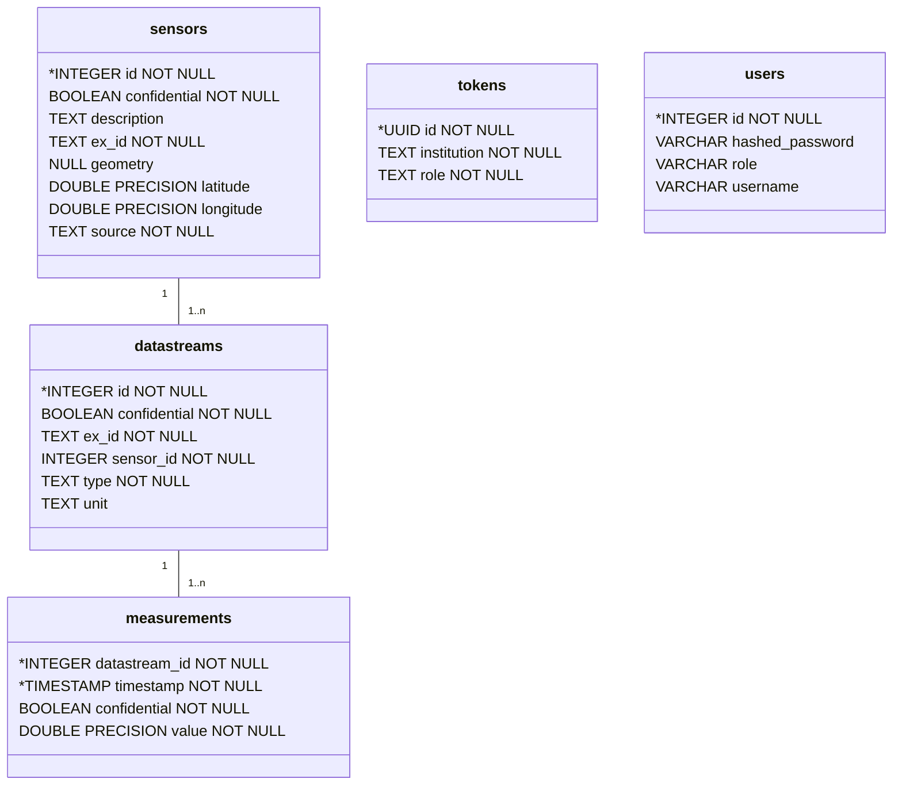

# ACDatEP

## What is this?

This repository describes the main artifacts of the ACDatEP project. The aim of the project is to create a data pool with high temporal and spatial resolution measurements. There are various services in this repository for this purpose, which are described below.

## Getting started
Quickest way to get started is docker:
1. Fill out the .env file with your credentials / set credentials
2. Run the stack using `docker compose up -d`

## Services
The following services are available:

### Database
A PostgreSQL database is deployed in a docker container with the recommended relations, which are described in the ER diagram below.
 

The database has the table 'sensors', which defines pyhsical sensors, 'datastreams', which defines the measured data and 'measurements', where only a timestamp, a value and the datastream_id is stored in.

A materialized view is created, which shows the latest measurement for each datastream.

Every table contains a column 'confidential' with default set to 'True', which is used by the API to exclude confidential or non-public information for unauthorized users.

### API
A REST-API is deployed in a docker container which allows basic inserting / updating / querying of the tables mentioned above.

A 'admin' type user (which can read / write / delete) and a 'read_all' type user (which can onlay read) can be configured in the .env file.

### Dashboards
To help understand the data and make it more accessable, a streamlit dashboard, which visualizes the data inside the database, is provided as well.

### Crawler
A number of crawler is deployed in a dockerized environment to populate the database.

For further information, see ./crawler/crawler.md
