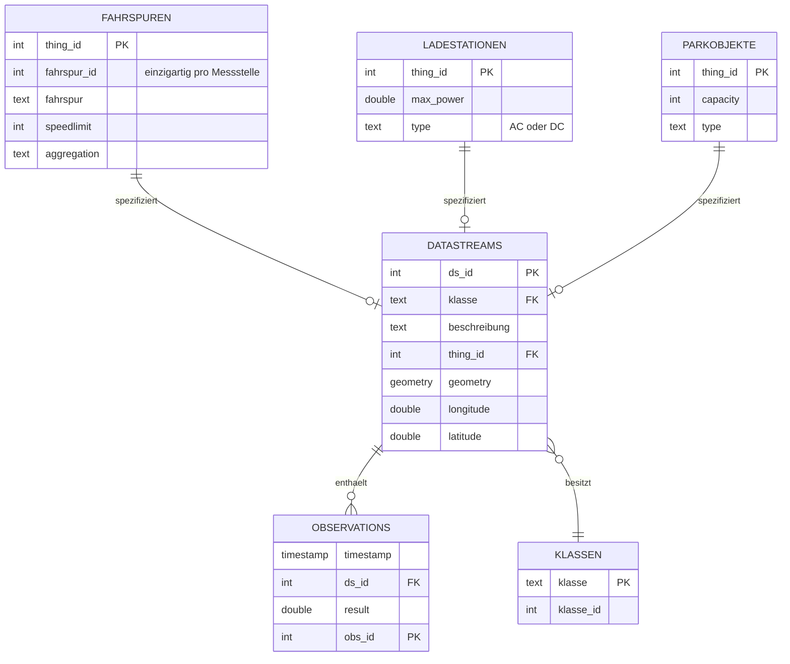

# Traffic Data Crawler

This crawler is designed to copy the relevant data from the Frost-Server employed by the city of Aachen to store tracked traffic data in a timescale data base.

https://verkehr.aachen.de/

The Frost data model is structured to split the data into 8 separate categories: 
1. Datastream
2. Observation
3. Thing
4. ObservedProperty
5. Sensor
6. Location
7. HistoricalLocation
8. FeatureOfInterest

Only the first three of these categories are crawled as they include most of the relevant information. 
For future versions of the software, including other categories can offer some additional help.

In general, Frost data is structured in two ways: fixed data fields enforced by the database and free fields. 
The crawler has to reflect this by only depending on the integrity of the fixed fields while accounting for as many inconsistencies in the freely structured data as possible.

## Quirks of the Frost Server

When working with a Frost server, some special considerations have to be made. 
The most important one concerns data requests adressed to the server.
The datbase will only ever answer with 1000 entries at a time, which makes it necessary to crawl the data in an iterative way and split requests into chunks of 1000.
In addition to the data, the server always answers with a string of the request that has to be made for the next 1000 entries.
If no such link exists, the end of the table has been reached.
This behaviour is used as termination condition for the loops that are used in this crawler.

## Datastreams

Datastreams are the main organizing category in the Frost data structure. 
They represent one possible output of one given sensor and are connected to one physical hing that is monitored. 
They are also connected to any number of observations, which each represent one sensor value at a specific time.

If a physical sensor has more than one possible output, it is represented by the same number of datastreams. 
For example if a parking area is outfitted with three charging columns for electrical cars, it could be represented by four independant datastreams: one measuring the percentage of occupied parking space and three more, each of which measures wether one of the chargers is used or not.

Datastreams include a unique ID as well as the two strings "name" and "description", which are also crawled to improve readability. 
Everything else can be stored in the "properties" field.

This structure leads to a lot of relevant information being stored in the relatively formless properties of the datastream, which causes problems for automated evaluation. 
While the data in general is ordered in some way, the structure is in no way enforced by the database, so the crawler has to account for inconsistencies and differing conventions for different types of datastreams.
Most importantly, the class of the datastream can be accessed in it's properties. 
In General, every datastream has a type, which is either calles "klasse" or "type". 
The biggest exception from this rule is weather data, which can be identified by its description. 
During crawling this is done by searching for a number of keywords ("weathertypes"). 
If any of them are found, the type "Wetter" is assigned. 
If a datastream has neither a type, nor a class or any of the weather keywords, the type "unknown" is assigned. 
Further information about these cases can manually be found in the "description" field. 
Automatically including further types using information from the description is possible but not yet implemented.

| column       | data type      | description                     | source                                         |
|--------------|----------------|---------------------------------|------------------------------------------------|
| ds_id        | integer        | unique id                       | sourced directly from Frost database           |
| klasse       | string         | general descriptive identifier  | sourced from Frost database except for weather |
| beschreibung | string         | specific description            | sourced directly from Frost database           |
| thing_id     | integer        | foreign key for thing tables    | sourced directly from Frost database           |
| geometry     | geometry       | location of the datastream      | sourced directly from Frost database           |
| longitude    | double         | longitude of the datastream     | centroid point of location                     |
| latitude     | double         | latitude of the datastream      | centroid point of location                     |

### klassen

In addition, some datastreams have a "KlasseID", which is of limited use because while it is linked to a specific Klasse, it is not unique. 
For this reason, for any datastream without a KlasseID, it is set to zero.
For Reference, the KlasseIDs with ther respective Klasse are stored in the "klassen" table of the timescale database. 

### geometry

Coordinates for the datastream are generally stored in the "observedArea"-variable which separated area types into points and polygons with coordinates fitting the specified category. 
Area data needs to be handled carefully however, because this is an optional field. 
The coordinates of some datastreams can be accessed by other optional fields in the "properties" object of the datastream, while others simply don't have coordinates. 
The crawler tries for one specific way of accessing geographical data from the datastream properties, which works for some charging stations for electric cars. 
Other exceptions are possible in which case the geometry field is empty.

Some datastreams are assigned points as geographical information, while others use polygons. This is reflected in two different ways:
- The geometry field stores the actual area as it is found in the frost database.
- The longitude and latitude fields describe a point that is either the one found in the frost database or one representative of the area for datastreams which aren't representative of points.

## specification through things

To help interpret the data of specific datastreams, frost things are crawled. The results are stored in three different tables, in order to account for the different data structures:
- fahrspuren
- ladestationen
- parkobjekte 

### fahrspuren

Special attention needs to be paid to datastreams that track traffic on specific lanes as the information identifying the lanes may be lost.
Traffic lane information can be identified by the field "fahrspur" in " properties". 
If a datastream is a traffic lane, additional information is saved to the table "fahrspuren". 
This table also uses the datastream ID as it's key, even though its data is comprised of both, things and datastreams. 
In addition, it includes a string "fahrspur" and a "fahrspurID", which is unique between multiple datastreams concerning different lanes of the same road, but not between multiple roads. 

| column      | data type | description                                             | source                               |
|-------------|-----------|---------------------------------------------------------|--------------------------------------|
| ds_id       | integer   | unique id                                               | sourced directly from Frost database |
| fahrspur_id | integer   | discerns different lanes at the same point              | sourced directly from Frost database |
| fahrspur    | text      | describes the specific lane and direction               | sourced directly from Frost database |
| speedlimit  | integer   | speedlimit for the specific lane                        | sourced directly from Frost database |
| aggregation | text      | specifies the time period over which traffic is counted | sourced directly from Frost database |

### ladestationen

In order to make this databases traffic data easier to use in calculations concerning energy usage, an additional table for charging station specifications is needed. It is identified by thing_id in order to accomodate charging stations with multiple ports. It includes the maximum charging power as well as the type of current it uses.

| column    | data type | description                        | source                               |
|-----------|-----------|------------------------------------|--------------------------------------|
| thing_id  | integer   | unique id, unique with parkobjekte | sourced directly from Frost database |
| max_power | double    | maximum power output               | sourced directly from Frost database |
| type      | text      | AC or DC                           | sourced directly from Frost database |

### parkobjekte

To statistically evaluate parking data, the additional table parkobjekte is needed. 

| column   | data type | description                          | source                                                        |
|----------|-----------|--------------------------------------|---------------------------------------------------------------|
| thing_id | integer   | unique id, unique with ladestationen | sourced directly from Frost database                          |
| capacity | integer   | number of available parking spots    | either read directly or counted from the number of sub-things |
| type     | text      | Parkfläche, Parkhaus, Parkplatz      | sourced directly from Frost database                          |

## observations

In the frost data structure, every observation is linked to one specific datastream. 
In order to reliably crawl all relevant observations, the crawler iterates through the datastreams found before and accesses the observations for one datastream at a time.
By ordering the results by their phenomenonTime it is possible to request the observation in chronological order, starting with the most recent date in the existing database.
In addition to the time, every observation carries a unique observation_id and a single result that is stored as a string in the Frost database. 

Working with strings for mostly number-based results is inefficient. 
For this reason, the results that are crawled are converted to numbers before being loaded into the timescale database.

This does not work for all of the database, as for example charging stations for electric cars can have three different text-based results. 
These are converted as follows:

| charging   | 1  |
|------------|----|
| available  | 0  |
| outoforder | -1 |

As of now there are some more exceptions that aren't recognised by the crawlers and therefore dropped. 
These comprise about 0.01% of the obervation data, of which the majority is weather data. Accounting for more such exceptions could be a possible extension of the crawler's functionality in the future.

| column    | data type | description                  | source                               |
|-----------|-----------|------------------------------|--------------------------------------|
| timestamp | timestamp | time of data collection      | sourced directly from Frost database |
| ds_id     | integer   | key of associated datastream | sourced directly from Frost database |
| result    | double    | some form of measurement     | converted to number as noted above   |
| obs_id    | integer   | unique id of observation     | sourced directly from Frost database |

## Data Model

Resulting from all of the above, the final timescale data model has the following relations:

